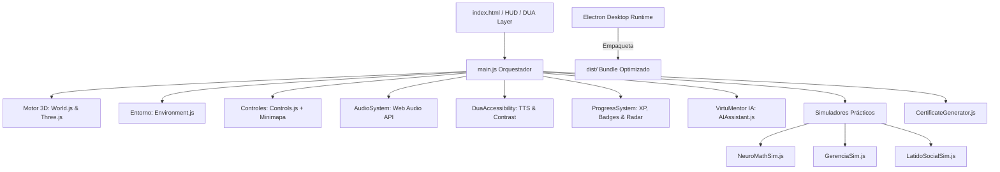

# UNIMINUTO VirtuXperience 3D — Ecosistema Virtual Narrativo e Inmersivo

> **Prueba Técnica de Evaluación Pedagógica y Tecnológica**  
> **Entidad:** Corporación Universitaria Minuto de Dios — UNIMINUTO Virtual  
> **Organización Evaluadora:** Virtual Experience Engineering SAS  
> **Referente Original:** [UNIMINUTO VirtuXperience Home](https://www.uniminuto.edu/virtuxperience-home)  
> **Versión del Proyecto:** 1.0.0 (Producción y Ejecutable de Escritorio)

---

## 1. Resumen Ejecutivo y Visión

**UNIMINUTO VirtuXperience 3D** supera el concepto tradicional de un micrositio web para transformarse en un **mundo virtual inmersivo, tridimensional, narrativo y adaptativo**. La solución sitúa al estudiante como un *Navegante del Conocimiento* dentro de un campus futurista compuesto por un **Ágora Central** y **6 Domos Temáticos Transversales**. 

En lugar de evaluar mediante pruebas memorísticas descontextualizadas, la plataforma se basa en **tres simuladores vivenciales prácticos** y un **Tutor de Inteligencia Artificial Adaptativa (VirtuMentor IA)** fundamentado en los principios del **Diseño Universal para el Aprendizaje (DUA)**.

---

## 2. Los 8 Requerimientos Técnicos y Pedagógicos Implementados

### 1. Mundo Virtual Inmersivo 3D (WebGL / Three.js)
- **Ágora Central UNIMINUTO**: Plataforma circular ceremonial con el *Cristal del Nexo Transversal* (octaedro físico con rotación multi-axial, halos volumétricos, anillos orbitales de energía y partículas cósmicas).
- **6 Domos Temáticos**: Arquitectura procedural de cúpulas semitransparentes, portales de energía holográficos, pedestales interactivos y códigos cromáticos oficiales de UNIMINUTO.
- **Canales de Conducción**: Caminos de luz bidireccionales que interconectan la plaza central con los 6 domos.

### 2. Arquitectura Narrativa Unificadora
- **Hilo Conductor**: *"La Restauración del Nexo Transversal"*. Una fluctuación cognitiva ha desconectado los vórtices del conocimiento. El estudiante debe interactuar con los mentores holográficos y superar retos prácticos para activar los núcleos de competencia.
- **Bitácora de Misiones Activas (Quest Tracker)** en pantalla con actualización dinámica de objetivos.

### 3. Rutas de Aprendizaje Articuladas (Niveles I, II y III)
Implementación integral de la matriz curricular técnica de VirtuXperience con sus 6 líneas transversales y subcomponentes:
1. **Comunicarte** 🔵: Escritura, Oralidad, Lectura, Multilingüismo (Niveles I, II, III).
2. **NeuroMath** 🟣: IA y Matemáticas, Cálculo, Fundamentos de Matemáticas, Álgebra, Desafiomente (Niveles I, II, III).
3. **VoxCivitas** 🏛️: Competencias Ciudadanas, Aprendizaje Autónomo, Proyecto de Vida (Niveles I, II, III).
4. **Gerencia+** 💼: Liderazgo Gerencial, Metodologías Ágiles, Marketing, Talento Humano (Niveles I, II, III).
5. **Activa Tu Idea** 💡: Investigación, Emprendimiento (Niveles I, II, III).
6. **Latido Social** ❤️: Responsabilidad Social, FEBIPE, Liderazgo Social (Niveles I, II, III).

### 4. Cuatro Formatos Pedagógicos Integrados por Domo
Siguiendo los lineamientos de VirtuXperience, cada estación ofrece contenido en 4 formatos:
- **Gamificados**: Retos interactivos, torneos de argumentación y simulaciones prácticas.
- **Audiovisuales**: Micro-cápsulas conceptuales en alta definición con subtitulado.
- **Sonoros**: Podcasts inmersivos con narración y transcripción textual completa.
- **Diagramas Interactivos**: Mapas conceptuales y matrices dinámicas de conocimiento.

### 5. Tres Simulaciones Prácticas Vivenciales
- **Simulador NeuroMath & IA**: Laboratorio de redes neuronales y optimización matemática. El estudiante modula la tasa de aprendizaje, regularización L2, capas ocultas y optimizador (Adam / SGD / RMSprop) para lograr generalización sin sobreajuste con curvas de pérdida en tiempo real en Canvas.
- **Simulador Gerencia+ (Metodologías Ágiles)**: Misión Sprint Crisis 4.0. Toma de decisiones estratégicas ante scope creep, deuda técnica, bloqueos de arquitectura y riesgo de burnout con medidores de Velocidad, Moral y Presupuesto.
- **Simulador Latido Social & VoxCivitas**: Laboratorio de Transformación Comunitaria. Asignación presupuestaria participativa de 100 unidades y elección del modelo de gobernanza democrática evaluando Cohesión Social, Sostenibilidad y Equidad.

### 6. Inteligencia Artificial Adaptativa ("VirtuMentor IA")
- **Diagnóstico Cognitivo DUA**: Clasifica al estudiante en perfiles (Visual/Espacial, Auditivo/Narrativo, Práctico/Kinestésico) y recalibra la experiencia en tiempo real.
- **Andamiaje Pedagógico (Scaffolding)**: Genera pistas graduales para superar los simuladores sin entregar la respuesta directa.
- **Motor Autónomo Standalone**: Funciona 100% sin depender de tokens o APIs de pago externas, garantizando disponibilidad offline.

### 7. Sistema de Progreso, Gamificación y Certificación
- **XP y Niveles de Navegante**: De Navegante I hasta Maestro VirtuXperience.
- **Radar de Dominio Hexagonal**: Gráfico Canvas en tiempo real de las 6 áreas.
- **Insignias 3D Coleccionables**: Científico de Datos, Scrum Master, Líder Social, entre otras.
- **Generador de Certificado Digital Oficial UNIMINUTO**: Diploma con código HASH de verificación académica listo para exportar o imprimir en PDF.

### 8. Principios DUA y Accesibilidad Universal (WCAG AAA)
- **Múltiples formas de representación**: Entorno 3D, lector Text-to-Speech (TTS) con voz sintetizada en español, infografías y transcripciones.
- **Múltiples formas de acción y expresión**: Controles de movimiento libre (WASD + mouse), teclado accesible directo (teclas 0 a 6 para teletransporte instantáneo sin barreras motoras) y minimapa interactivo táctil.
- **Múltiples formas de implicación**: Modo Alto Contraste para baja visión, selector de tamaño tipográfico y desactivador de movimiento para sensibilidad vestibular.

---

## 3. Arquitectura del Sistema



---

## 4. Tecnologías Utilizadas

- **Núcleo 3D y Gráficos:** Three.js (WebGL 2.0 / PBR Materials / Directional Soft Shadows / Canvas Textures / Particles).
- **Audio y Sonido Espacial:** Web Audio API (Generador sintético harmónico en tiempo real).
- **Accesibilidad y Síntesis de Voz:** Web Speech Synthesis API (`es-ES`, `es-CO`).
- **Empaquetado y Build:** Vite 6.x (Compilación optimizada de assets).
- **Ejecutable de Escritorio:** Electron 34.x (Distribución de escritorio multiplataforma).
- **Estilos:** Vanilla CSS con arquitectura Glassmorphism, CSS Custom Properties y compatibilidad WCAG AAA.

---

## 5. Instrucciones de Instalación y Ejecución

### Requisitos del Sistema
- **Sistema Operativo:** macOS (11+), Windows (10/11) o Linux (Ubuntu 20.04+).
- **Entorno de ejecución:** Node.js v18 o superior (recomendado v20+ o v22+).
- **Navegador Web (para versión web):** Chrome, Edge, Safari o Firefox con soporte WebGL.

---

### Opción A: Ejecutable de Virtual Experience Engineering SAS (Recomendada para Evaluadores)

Para ejecutar la aplicación de escritorio nativa distribuida:

#### En macOS:
1. Haz doble clic sobre el archivo ejecutable:
   ```bash
   ./start-macos.command
   ```
   *(O desde terminal en la raíz del proyecto: `./run_virtuxperience.sh`)*

#### En Windows:
1. Haz doble clic sobre:
   ```cmd
   start-windows.bat
   ```

#### En Linux / macOS por Terminal:
```bash
chmod +x ./run_virtuxperience.sh
./run_virtuxperience.sh
```

---

### Opción B: Ejecución en Modo Web Local

1. Instalar dependencias del proyecto:
   ```bash
   npm install
   ```

2. Compilar el paquete de producción:
   ```bash
   npm run build
   ```

3. Iniciar el servidor local de desarrollo / demostración:
   ```bash
   npm run dev
   ```
   Abre tu navegador en: `http://localhost:5173/`

4. Para previsualizar el bundle de producción en servidor estático:
   ```bash
   npm run preview
   ```

---

## 6. Guía Rápida de Navegación y Atajos de Teclado

| Tecla / Acción | Función en VirtuXperience |
| :--- | :--- |
| **W, A, S, D** o Flechas | Desplazamiento libre por el campus universitario |
| **Mouse / Click Drag** | Orientación de la cámara (Mirar alrededor en 360°) |
| **Clic sobre Pedestal / Tecla E** | Interactuar con la estación temática o el Nexo Central |
| **Tecla 0** | Teletransporte instantáneo al **Ágora Central** |
| **Tecla 1** | Teletransporte instantáneo al **Domo Comunicarte** 🔵 |
| **Tecla 2** | Teletransporte instantáneo al **Domo NeuroMath** 🟣 |
| **Tecla 3** | Teletransporte instantáneo al **Domo VoxCivitas** 🏛️ |
| **Tecla 4** | Teletransporte instantáneo al **Domo Gerencia+** 💼 |
| **Tecla 5** | Teletransporte instantáneo al **Domo Activa Tu Idea** 💡 |
| **Tecla 6** | Teletransporte instantáneo al **Domo Latido Social** ❤️ |
| **Tecla M** | Desplegar el **Árbol de Competencias Curriculares y Radar** |
| **Clic en Minimapa** | Teletransporte interactivo por coordenadas espaciales |

---

## 7. Criterios de Evaluación y Evidencias Técnicas

| Criterio de Valoración | Cómo se Cumple en esta Solución |
| :--- | :--- |
| **Interpretación del requerimiento** | Mapeo riguroso de las 6 líneas y sus subcompetencias exactas en niveles I, II y III. |
| **Calidad de la experiencia inmersiva** | Campus 3D tridimensional con iluminación PBR, partículas, arquitectura de domos y niebla espacial. |
| **Narrativa y coherencia** | "Restauración del Nexo Transversal" con mentores PNJ, bitácora de misiones y recompensas. |
| **Nivel de interacción práctica** | 3 simuladores completos vivenciales (NeuroMath, Gerencia+, Latido Social) con toma de decisiones real. |
| **Inteligencia Artificial** | VirtuMentor IA con diagnóstico DUA, andamiaje cognitivo y evaluación adaptativa. |
| **Accesibilidad DUA** | Lector TTS por síntesis de voz, modo alto contraste WCAG AAA, tipografía escalable y controles sin barreras. |
| **Ejecutable y Repositorio** | Repositorio Git limpio, scripts lanzadores de un solo clic y aplicación Electron empaquetada. |

---

## 8. Créditos y Autoría

- **Entidad Patrocinadora:** UNIMINUTO Virtual — Iniciativa Estratégica VirtuXperience
- **Desarrollo y Evaluación:** Virtual Experience Engineering SAS
- **Fecha de Entrega:** 2026
